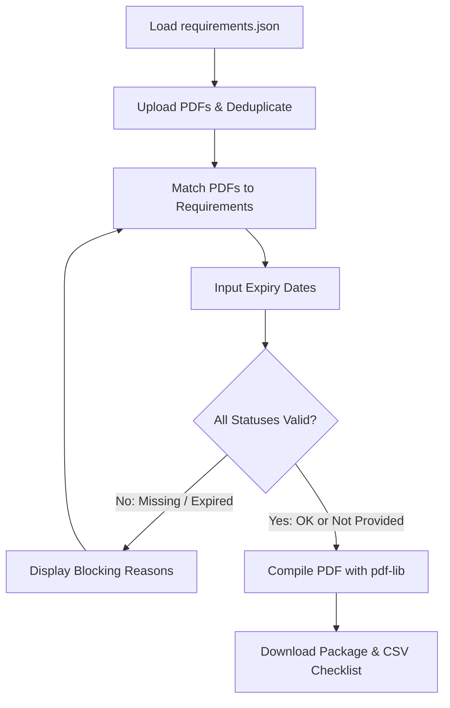

# SPEC.md — Tender Document Package Builder

## 1. Requirements

### Main Requirements
- **R01 [MAIN] Load Requirements**: User loads `requirements.json` (or uses built-in default seed). Shows tender metadata (tender_id, title, procuring_entity, bidder, submission_deadline) and the list of required documents sorted by `order`.
- **R02 [MAIN] Multi-file Upload**: User can upload multiple PDF files simultaneously. Displays each file's filename and page count. Non-PDF files are rejected with an explicit bilingual error message. Any uploaded file can be removed.
- **R03 [MAIN] File Matching**: User matches an uploaded file to a required document slot. Constraints: at most 1 file per document, at most 1 document per file. Matches can be altered or undone at any time.
- **R04 [MAIN] Expiry Date Input**: For documents with `has_expiry = true` that have a matched file, an expiry date input (`YYYY-MM-DD`) is provided.
- **R05 [MAIN] Real-Time Status Verification**: Every required document displays exactly one of 5 statuses updated instantly on any change:
  - `Missing`: Required (`mandatory: true`), no file matched. **Blocks package**.
  - `Expiry date needed`: `has_expiry: true`, file matched, but no expiry date entered. **Blocks package**.
  - `Expired`: Expiry date is before `submission_deadline`. **Blocks package**.
  - `Not provided`: Optional document (`mandatory: false`), no file matched. **Does not block**.
  - `OK`: File matched, and if `has_expiry: true`, expiry date is `>= submission_deadline`. Same-day expiry is OK. **Does not block**.
- **R06 [MAIN] Duplicate Detection**: Files with identical binary content (SHA-256 hash match) are flagged as duplicates. Disallow matching duplicate files to different documents.
- **R07 [MAIN] Package Assembly**: The "Generate Package" button is disabled whenever any document has a blocking status, clearly displaying blocking reasons. When all blocking issues are resolved, generates one combined PDF following Section 6 rules.
- **R08 [MAIN] Package Download**: User downloads the combined PDF named `<tender_id>_Package.pdf` (e.g., `T-2026-0417_Package.pdf`).
- **R09 [MAIN] Full Bilingual Parity (EN / BN)**: Instant toggle between English and Bangla. Document titles render from `title_en` or `title_bn`. All UI labels, buttons, badges, status names, and validation messages have zero hardcoded text and full parity.
- **R10 [MAIN] PDF Package Formatting**:
  - Page 1 Cover Page: In English. Displays tender ID, title, procuring entity, bidder name, submission deadline, package generation date, and ordered list of included documents.
  - Page Order: Sorted strictly by requirement `order`. Includes all original pages of each matched file in order. Skips unprovided optional documents.
  - Running Footers: Every page (including cover) has `<tender_id> | Page X of Y` where Y is total pages. Easy to read, non-obscuring.

### Bonus Requirements
- **R11 [BONUS] Index / Table of Contents Page**: Dedicated page following cover showing starting page numbers for each included document.
- **R12 [BONUS] Seal / Signature Placement**: User can upload PNG seal/signature and apply it to designated pages with preview.
- **R13 [BONUS] Checklist Export**: Export full checklist as CSV / Excel (`document`, `filename`, `pages`, `expiry_date`, `status`).
- **R14 [BONUS] Persistence & Project Save/Open**: State saved to `localStorage` under `app:v1:*` keys; export/import project JSON.
- **R15 [BONUS] Bangla PDF Cover & Index**: Option to render cover and index page in Bangla using embedded font / SVG rasterization.
- **R16 [BONUS] Smart Auto-Match**: Heuristic filename fuzzy matching to automatically suggest or link documents.
- **R17 [BONUS] Defensive File Handling**: Gracefully catch encrypted, damaged, or oversized files with helpful bilingual notices.

### Deliverables
- **R18 [DELIVERABLE] Clean Git Repository**: Minimum 3 commits, commit every 25-30 min with prompt annotations.
- **R19 [DELIVERABLE] Output Artifact**: `output/<tender_id>_Package.pdf` in repository.
- **R20 [DELIVERABLE] Screenshots**: `/screenshots/` folder containing at least status dashboard and key flows.
- **R21 [DELIVERABLE] README.md**: Name, reg number, live URL, commands, features, bonus, AI tools, architecture.
- **R22 [DELIVERABLE] MIT LICENSE**: Included in repo.
- **R23 [DELIVERABLE] Production HTTPS Deployment**: Vercel public live URL, accessible without auth.

---

## 2. Edge-Case Matrix

| Scenario | Input | Expected Output | R-ID |
|---|---|---|---|
| Non-PDF uploaded | `company_logo.png` (5.3 KB) | Rejected with error "Only PDF files are allowed", not added to file list | R02 |
| Duplicate content | `experience_cert (1).pdf` and `experience_cert.pdf` (same hash) | Both flagged with "Duplicate file detected"; matching one blocks the other | R06 |
| Same-day expiry | Expiry date `2026-10-20`, deadline `2026-10-20` | Status is `OK` (not expired) | R05 |
| One day before expiry | Expiry date `2026-10-19`, deadline `2026-10-20` | Status is `Expired`, blocks generation | R05 |
| Optional document skipped | `R06` (Audited Financial Statement) has no file | Status `Not provided`, does NOT block package | R05 |
| Optional document provided but expired | `R07` (Manufacturer's Auth) matched with expired date | Status `Expired`, BLOCKS package | R05 |
| Missing expiry on optional | `R07` matched, no date entered | Status `Expiry date needed`, BLOCKS package | R05 |
| Corrupt or invalid PDF | 0-byte file or non-PDF binary renamed `.pdf` | Caught gracefully at upload/parse; error badge shown | R17 |
| Long titles in Bangla/English | Deeply nested long department strings | Truncate cleanly or wrap safely; no layout blowouts | R09 |
| Zero matched documents | Fresh requirements loaded | Generate button disabled, "10 items missing" alert | R07 |
| Unmatch / Swap | Unmatch file from R01 | R01 immediately reverts to `Missing`, Generate button disables | R03 |

---

## 3. Core Flow Diagram



---

## 4. Key Assumptions
1. Single cover page in English is default per Section 6.1; optional Bangla cover toggle provided.
2. Deduplication check is done via SHA-256 byte digest on file load.
3. Total combined package size is under 50 MB and <= 30 files per Section 8 limits.
4. Footers are placed cleanly at the bottom margin with white background banner or translucent pill to avoid obscuring document text.

---

## 5. Top 3 Ambiguities for Organizers
1. If an optional document is matched to a file with `has_expiry = true`, does an expired date block the package? *(Assumed YES, since if provided it must be valid).*
2. Should duplicate files be allowed to be uploaded if neither is matched, or rejected immediately? *(Assumed allowed in upload pool with visual warning; matching blocked).*
3. For Cover page generation, should date format strictly be `YYYY-MM-DD`? *(Assumed standard ISO YYYY-MM-DD).*

---

## 6. Architecture & Data Model

### Data Model
```typescript
export interface TenderMetadata {
  tender_id: string;
  title: string;
  procuring_entity: string;
  bidder: string;
  submission_deadline: string; // YYYY-MM-DD
}

export interface RequirementItem {
  id: string;
  order: number;
  title_en: string;
  title_bn: string;
  mandatory: boolean;
  has_expiry: boolean;
}

export interface UploadedFileMeta {
  id: string;
  file: File;
  name: string;
  size: number;
  pageCount: number;
  hash: string;
  isDuplicate: boolean;
  duplicateOf?: string;
  pdfBytes?: ArrayBuffer;
  error?: string;
}

export type RequirementStatus = 'missing' | 'expiry_needed' | 'expired' | 'not_provided' | 'ok';

export interface DocumentMatch {
  requirementId: string;
  fileId?: string;
  expiryDate?: string; // YYYY-MM-DD
  status: RequirementStatus;
  blocking: boolean;
}
```

### Storage Keys
`app:v1:tender_state` (persists tender metadata, matches, expiry dates, theme, language).

---

## 7. Scope Cut & Slices

- **Slice S1 (Core Logic)**: Models, validator for requirements.json, SHA-256 deduplication, status computer, delta describer, unit tests. (Done when pure logic passes test suite).
- **Slice S2 (Scaffold & Shell)**: Vite + React 19 + Tailwind v4 + M3 Expressive tokens + bilingual toggle + layout & dock. (Done when app runs with clean tokens).
- **Slice S3 (Upload, Match & Verification UI)**: File upload dropzone, PDF page count reader, interactive matching, expiry date picker, instant status badges, duplicate alerts. (Done when sample pack loads and correctly flags duplicates & expired license).
- **Slice S4 (PDF Assembly & Export)**: `pdf-lib` pipeline: English cover page, running footers (`<tender_id> | Page X of Y`), document merging, download `<tender_id>_Package.pdf`, CSV export. (Done when sample pack generates valid combined PDF).
- **Slice S5 (Bonus Features & Polish)**: Index page, seal PNG upload, auto-match button, project import/export, error boundary. (Done when bonuses pass).

---

## 8. Design Brief (Material 3 Expressive)
1. **Seed Hex**: `#00677d` (Deep Ocean Cyan / Teal) — resonates with institutional trust, legal procurement, and clarity.
2. **Hero Element**: Status & Readiness Command Card (Primary Container) displaying live package readiness (e.g., "10/10 Ready to Generate" or "3 Blockers").
3. **Color Roles**:
   - Page surface: `surface`
   - Hero card: `primaryContainer`
   - Document table / cards: `surfaceContainerLow`
   - Action controls / dock: `surfaceContainerHigh`
   - Blocking / error badges: `errorContainer`
   - OK badges: `tertiaryContainer`
4. **Typography**: Noto Sans Bengali Variable (self-hosted), weights 400, 600, 700. Tabular figures for numbers and dates.
5. **Button Physics**: Resting radius `h/2` (28px for M), pressed radius 12px, 400ms spring release.
6. **Dock Actions**: 1. Generate Package (Primary filled pill), 2. Auto-Match, 3. Upload PDFs, 4. Export CSV.
